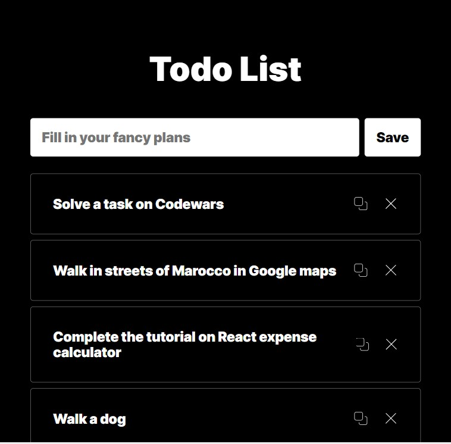

# :large_blue_circle: To-do list on JS classes

A study project at Practicum by Yandex on Objected Oriented Programming and Api.
A simple to-do list with adding, deleting and copying tasks.

---

## :mag_right: Preview

---

## :link: Links to test

https://dianadomino24.github.io/todo-list/

---

## :rocket: Technologies

-   **JavaScript ES6**

-   semantic **HTML5**, styles - **CSS3** including Flexbox

-   **Object Oriented programming**

-   Api.

---

**Practicum by Yandex** - https://practicum.yandex.com/

---

## :sparkles: Thanks for watching! :sparkles:
